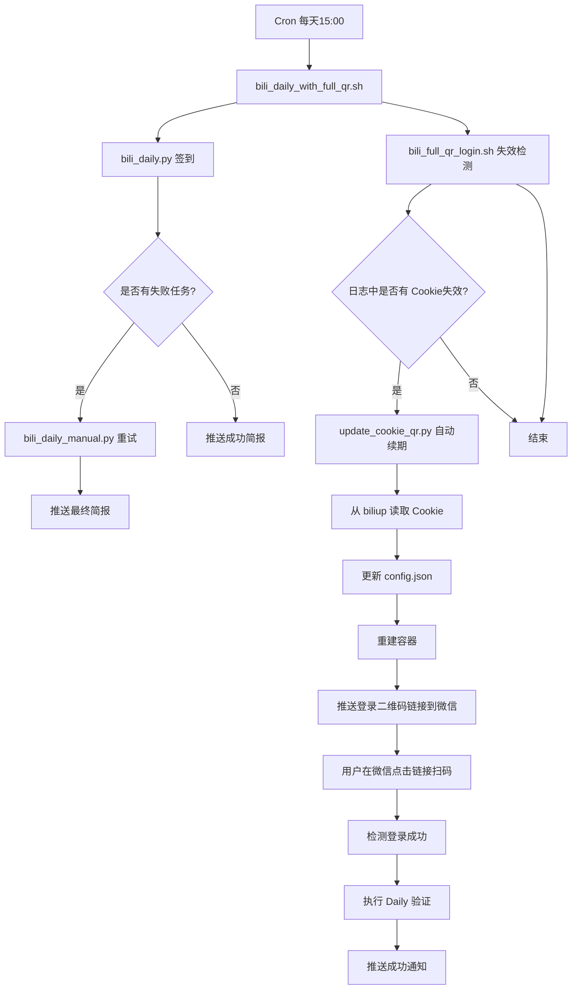

# B站签到机器人

[](https://opensource.org/licenses/MIT)
[](https://www.python.org/downloads/)
[](https://www.docker.com/)

> 基于 Docker 的 B站签到自动化系统，支持每日自动签到、失败重试、Cookie 自动续期、企业微信推送。

---

## 📌 项目简介

本项目整合了 [BiliBiliToolPro](https://github.com/RayWangQvQ/BiliBiliToolPro) 和 [biliup](https://github.com/biliup/biliup)，构建了一套完整的 B站签到自动化解决方案。

**核心交互方式**：

- **首次部署**：终端完成双码登录（BiliBiliToolPro + biliup），一次配置长期有效
- **Cookie 自动续期**：微信推送二维码链接，完全远程扫码，无需登录服务器

---

## ✨ 功能特性

| 功能 | 说明 |
|------|------|
| **每日定时签到** | 每天 15:00 自动执行 B站每日任务（签到、投币、观看分享等） |
| **失败任务重试** | 单个任务失败后自动重试（最多 6 次），并推送最终简报 |
| **Cookie 自动续期** | 通过 biliup 的 refresh_token 机制，在 Cookie 失效时自动完成续期 |
| **双模式二维码登录** | 首次部署在终端扫码，Cookie 续期时微信远程扫码，兼顾安全与便利 |
| **周期统计报告** | 在周、月、季、半年、年的第一天自动推送上一周期的数据统计 |
| **企业微信推送** | 所有通知（签到结果、续期状态、错误告警）均实时推送到企业微信群 |
| **一键部署与诊断** | 提供交互式部署脚本和全面诊断工具，降低使用门槛 |

---

## 🧠 系统架构与运行逻辑

### 整体架构



### 首次部署流程

1. 用户运行 `./deploy_bili.py`
2. 交互式输入：安装目录、大会员状态、等级、投币开关、银瓜子兑换、大会员权益
3. 输入企业微信 Webhook Key 和 B站 Cookie（或选择扫码）
4. 脚本生成 `config.json` 和 `.bili_webhook_key`
5. 部署 Docker 容器（注入所有环境变量）

**双码登录（终端）**：
- **第一码（BiliBiliToolPro）**：容器启动后，执行 `Login` 任务，终端显示二维码，用户扫码完成签到工具登录
- **第二码（biliup，可选但建议）**：用户手动执行一次 `biliup login`，终端显示二维码，扫码后保存 `refresh_token`，用于后续 Cookie 自动续期

6. 自动执行 `Daily` 测试，验证签到成功
7. 提示设置 Cron 任务（脚本可自动添加）

### 每日自动签到流程

- Cron 触发 `bili_daily_with_full_qr.sh`
- 执行 `bili_daily.py` 签到
- 若全部成功 → 推送简报
- 若有失败 → 调用 `bili_daily_manual.py` 重试（最多 6 次）→ 推送最终简报
- 执行 `bili_full_qr_login.sh` 检测日志是否包含 Cookie 失效关键词
- 若失效 → 触发自动续期

### Cookie 自动续期流程（完全远程）

1. `update_cookie_qr.py` 从 `~/.biliup/cookie.json` 读取最新 Cookie（利用 biliup 的 refresh_token 机制）
2. 更新 `config.json` 中的 `BiliBiliCookies`
3. 重建容器（注入推送环境变量）
4. 调用 `auto_login_and_push.sh`，执行 `Login` 任务
5. **提取二维码链接，通过企业微信推送到您的手机**
6. 您在微信中点击链接查看二维码，用 B站 App 扫码完成容器登录
7. 每隔 5 秒执行 `Test` 任务检测登录状态（`【账号个数】1个`）
8. 登录成功后执行 `Daily` 任务验证
9. 推送“签到已恢复”成功通知
10. 若续期失败，推送告警

**整个续期过程无需登录服务器，完全通过微信完成。**

---

## 📦 文件结构

```
bili-bot/
├── config.template.json            # 配置模板（用户需重命名为 config.json）
├── .bili_webhook_key.template      # Webhook Key 模板
├── deploy_bili.py                  # 首次部署交互脚本
├── bili_common.py                  # 公共函数库
├── bili_daily.py                   # 每日签到主脚本
├── bili_daily_manual.py            # 失败任务重试脚本
├── update_cookie_qr.py             # 自动续期核心脚本
├── auto_login_and_push.sh          # 二维码推送脚本
├── bili_full_qr_login.sh           # Cookie 失效检测脚本
├── bili_daily_with_full_qr.sh      # Cron 包装脚本
├── push_qr.sh                      # 手动推送二维码（备用）
├── check_bili_final.sh             # 综合诊断脚本
├── bili_bot_ultimate_check.sh      # 终极自检脚本
├── logs/                           # 日志目录（自动生成）
│   └── daily_YYYYMMDD.log
└── data/                           # 数据目录（自动生成）
    └── bili_stats.db               # SQLite 数据库
```

---

## 🚀 快速部署

### 环境要求

- **操作系统**：Debian/Ubuntu（其他 Linux 发行版需自行适配）
- **Docker**：20.10+
- **Python**：3.8+
- **工具**：`jq`、`expect`、`pipx`

### 一键安装依赖

```bash
# 安装 Docker
curl -fsSL https://get.docker.com | bash -s docker

# 安装系统工具
sudo apt update
sudo apt install -y python3 python3-pip jq expect pipx

# 安装 biliup
pipx install biliup
export PATH="$HOME/.local/bin:$PATH"
```

### 部署项目

1. **克隆或解压项目**
   ```bash
   git clone https://github.com/你的用户名/bili-bot.git
   cd bili-bot
   ```

2. **创建配置**
   ```bash
   cp config.template.json config.json
   cp .bili_webhook_key.template .bili_webhook_key
   ```

3. **编辑配置**
   - 将 `config.json` 中的所有 `{{INSTALL_DIR}}` 替换为实际安装路径（如 `/home/zh/bili`）
   - 在 `.bili_webhook_key` 中填入企业微信机器人的 Webhook Key（仅 Key 值）

4. **运行部署脚本**
   ```bash
   ./deploy_bili.py
   ```
   按提示输入：
   - 安装目录（默认当前目录）
   - 是否大会员
   - 会员等级（1-6）
   - 投币开关（自动推荐）
   - 银瓜子兑换开关
   - 大会员权益开关
   - 企业微信 Key（若未提前填写）
   - B站 Cookie（或选择扫码）

5. **完成双码登录**
   - BiliBiliToolPro 登录：部署脚本自动执行，二维码显示在终端，扫码完成
   - biliup 登录（可选但建议）：手动执行 `biliup login`，终端显示二维码，扫码完成（仅需一次，用于后续自动续期）

6. **配置 Cron 任务**
   ```bash
   crontab -e
   # 添加以下行（替换为你的安装目录）
   0 15 * * * /你的安装目录/bili_daily_with_full_qr.sh >> /你的安装目录/logs/cron.log 2>&1
   ```

7. **验证部署**
   ```bash
   ./check_bili_final.sh
   ```

---

## 🛠️ 使用指南

| 操作 | 命令 |
|------|------|
| **手动签到** | `cd /你的安装目录 && python3 bili_daily.py` |
| **手动续期** | `cd /你的安装目录 && python3 update_cookie_qr.py` |
| **手动推送二维码** | `cd /你的安装目录 && ./auto_login_and_push.sh` |
| **查看今日日志** | `tail -f /你的安装目录/logs/daily_$(date +%Y%m%d).log` |
| **运行诊断** | `/你的安装目录/check_bili_final.sh` |
| **终极自检** | `/你的安装目录/bili_bot_ultimate_check.sh` |
| **查看容器日志** | `docker logs bili --tail 50` |
| **重启容器** | `docker restart bili` |
| **biliup 手动登录** | `biliup login`（终端显示二维码，扫码完成） |

---

## 🔐 安全与隐私

- **所有敏感信息（B站 Cookie、Webhook Key）均存储在本地文件**，不会上传至 GitHub。
- **配置模板**中的路径使用 `{{INSTALL_DIR}}` 占位符，用户部署时自行替换。
- 发布包中**不包含**任何用户数据（日志、数据库）。
- **双码登录设计**：首次部署在终端完成扫码，确保环境安全；Cookie 续期时二维码推送到微信，兼顾便利性。

---

## ❓ 常见问题排查

| 问题 | 可能原因 | 解决方法 |
|------|----------|----------|
| `【账号个数】0个` | Cookie 无效或过期 | 运行 `./update_cookie_qr.py` 自动续期，或 `biliup login` 重新扫码 |
| 企业微信未收到推送 | Webhook Key 错误或网络问题 | 检查 `.bili_webhook_key` 内容，测试 `curl` 到 Webhook URL |
| 容器未运行 | 系统重启或容器崩溃 | `docker start bili`，检查 `--restart` 策略 |
| Cron 任务未执行 | crontab 未正确添加 | `crontab -l` 确认，检查 cron 服务状态 |
| 续期时微信未收到二维码 | 容器未完全启动或网络问题 | 手动运行 `./auto_login_and_push.sh` 重试 |
| 二维码链接无法打开 | 网络或企业微信限制 | 直接在浏览器中访问链接，或用 B站 App 扫码 |
| biliup 续期失败 | refresh_token 过期 | 重新执行 `biliup login` 扫码 |

---

## 📚 依赖项目

- [BiliBiliToolPro](https://github.com/RayWangQvQ/BiliBiliToolPro) — B站签到核心（MIT License）
- [biliup](https://github.com/biliup/biliup) — Cookie 续期工具（GPL-3.0）
- [企业微信机器人](https://work.weixin.qq.com/api/doc/90000/90136/91770) — 消息推送

---

## 📄 许可证

本项目采用 [MIT License](LICENSE) 开源协议，使用前请遵守各依赖项目的许可证。

---

## 🤝 贡献

欢迎提交 Issue 和 Pull Request。

---

**祝你签到愉快！🎉**
