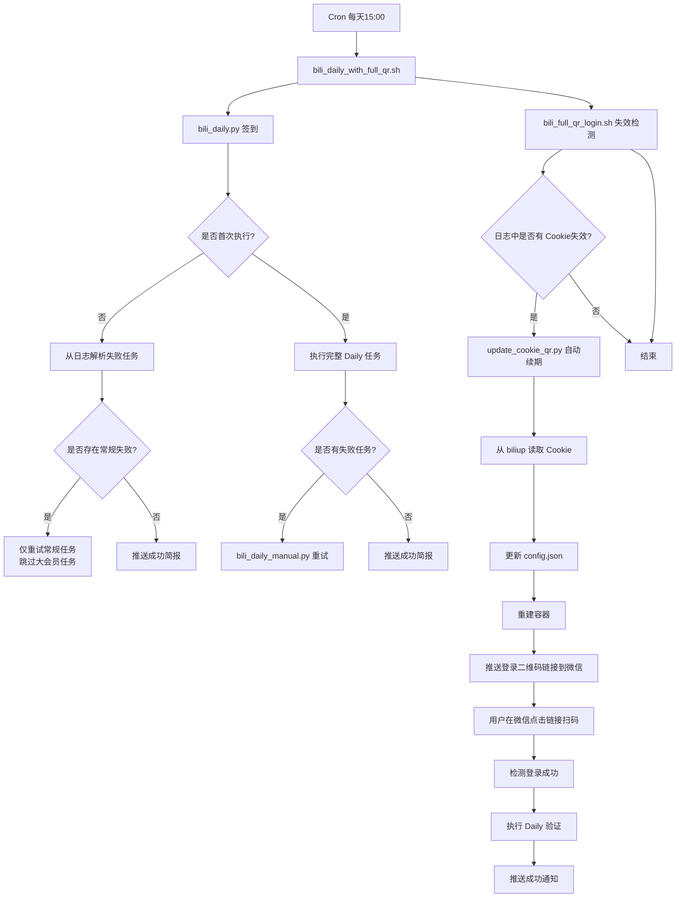

# B站签到机器人

[](https://opensource.org/licenses/MIT)
[](https://www.python.org/downloads/)
[](https://www.docker.com/)

> 基于 Docker 的 B站签到自动化系统，支持每日自动签到、失败重试、Cookie 自动续期、企业微信推送。

---

## 📌 项目简介

本项目整合了 [BiliBiliToolPro](https://github.com/RayWangQvQ/BiliBiliToolPro) 和 [biliup](https://github.com/biliup/biliup)，构建了一套完整的 B站签到自动化解决方案。

**核心交互方式**：

- **首次部署**：终端完成双码登录（BiliBiliToolPro + biliup），一次配置长期有效
- **Cookie 自动续期**：微信推送二维码链接，完全远程扫码，无需登录服务器

---

## ✨ 功能特性

| 功能 | 说明 |
|------|------|
| **每日定时签到** | 每天 15:00 自动执行 B站每日任务（签到、投币、观看分享等） |
| **智能重试机制** | 当日首次执行完整签到，后续只重试真正失败的任务（大会员任务自动跳过） |
| **⭕️ 大会员任务标识** | 大会员福利、B币券充电等任务失败时显示 ⭕️，表示已领取/无需重试 |
| **❌ 常规任务标识** | 登录、观看分享、漫画签到等任务失败时显示 ❌，会自动重试 |
| **失败任务重试** | 常规任务失败后自动重试（最多 3 次），并推送最终简报 |
| **Cookie 自动续期** | 通过 biliup 的 refresh_token 机制，在 Cookie 失效时自动完成续期 |
| **双模式二维码登录** | 首次部署在终端扫码，Cookie 续期时微信远程扫码，兼顾安全与便利 |
| **周期统计报告** | 在周、月、季、半年、年的第一天自动推送上一周期的数据统计 |
| **企业微信推送** | 所有通知（签到结果、续期状态、错误告警）均实时推送到企业微信群 |
| **一键部署与诊断** | 提供交互式部署脚本和全面诊断工具，降低使用门槛 |

---

## 🧠 系统架构与运行逻辑

### 整体架构



### 简报状态标识说明

| 标识 | 含义 | 是否重试 |
|------|------|----------|
| ✅ | 任务成功 | 不重试 |
| ⭕️ | 大会员任务已领取/无需处理 | 不重试 |
| ❌ | 常规任务失败 | 自动重试（最多3次） |
| ⏭️ | 任务已跳过（未到执行日期） | 不重试 |

## 📦 文件结构

```
bili-bot/
├── config.template.json            # 配置模板
├── .bili_webhook_key.template      # Webhook Key 模板
├── deploy_bili.py                  # 首次部署脚本
├── bili_common.py                  # 公共函数库
├── bili_daily.py                   # 每日签到主脚本
├── bili_daily_manual.py            # 失败任务重试脚本
├── update_cookie_qr.py             # 自动续期核心
├── auto_login_and_push.sh          # 二维码推送
├── bili_full_qr_login.sh           # Cookie 失效检测
├── bili_daily_with_full_qr.sh      # Cron 包装
├── push_qr.sh                      # 手动推送二维码
├── check_bili_final.sh             # 诊断脚本
├── bili_bot_ultimate_check.sh      # 终极自检
├── logs/                           # 日志目录
└── data/                           # 数据目录
```

---

## 🚀 快速部署

### 环境要求

- Debian/Ubuntu 系统
- Docker 20.10+
- Python 3.8+
- jq, expect, pipx

### 一键安装依赖

```bash
curl -fsSL https://get.docker.com | bash -s docker
sudo apt update
sudo apt install -y python3 python3-pip jq expect pipx
pipx install biliup
export PATH="$HOME/.local/bin:$PATH"
```

## 📄 许可证

MIT License

---

**祝b友签到愉快！🎉**
